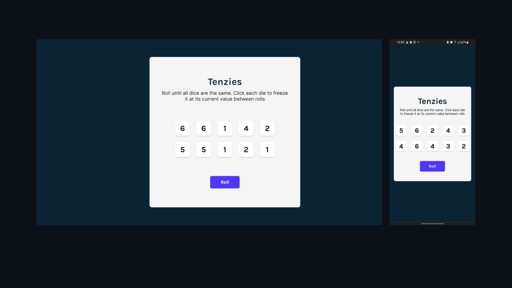

# Make.Meme

## VIDEO PREVIEW!!

## Check out my latest project >> [ Tenzies.com](https://Mofe1015.github.io/Tenzies)

This is a fully functional Tenzies game made with REACT, JAVASCRIPT, CSS, HTML.
implementing the basic workings of REACT with features like state, effect

With futures like freezing dice, and stsrting a new game

So far, The web app fully is mobile responsive .

## NOTICE!!

    This is just a Project WebApp, certain  features may not be  functional

## Design ❄👌

- Front End: HTML, CSS, Vanilla JS, REACTjs
- Back End: JavaScript

## Building 🏢🚀

1. Clone the repo to your local computer.
2. Make sure you have Node, Npm and its necessary packages installed.
3. Open and run the the project with VS Code or Android Studio 3.x(Using: "npm start" in the integrated terminal)

## Contribution 🍕🗺

Feature requests, issues, pull requests and questions are welcome.

## Bugs 😭🐛

If you encounter any bugs or are facing any issues with the code, please don't hesitate to reach out to me.

email : mofeomotosho@gmail.com

### MOFE
